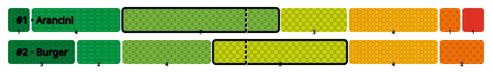

# Majority Judgment PHP Library

[](./LICENSE)
[](https://github.com/MieuxVoter/majority-judgment-library-php/releases)
[](https://github.com/MieuxVoter/majority-judgment-library-php/actions)
[](https://www.codefactor.io/repository/github/mieuxvoter/majority-judgment-library-php)
[](https://discord.gg/k9YRuZPSZs)


Rank candidates of Majority Judgment polls.


## Features

- [x] Majority judgment deliberation from merit profiles
- [x] Fast & extensible
- [x] Supports billions of voters
- [x] Supports thousands of candidates
- [x] Interface-oriented, test-driven code
- [x] Room for other majority systems (usual, central, etc.)
- [x] Using composer and PSR-4 namespaces


## Installation

Require it in your own project, using composer:

    composer require mieuxvoter/majority-judgment


## Usage example

Let's say you have a poll with two candidates and merit profiles like so:



You can get the rank of each candidate like so:

```php
use MieuxVoter\MajorityJudgment\MajorityJudgmentDeliberator;
use MieuxVoter\MajorityJudgment\Model\Settings\MajorityJudgmentSettings;
use MieuxVoter\MajorityJudgment\Model\Tally\ArrayPollTally;

$tally = new ArrayPollTally([
    'Proposal A' => [1, 1, 4, 3, 7, 4, 1], // amount of judgments for each grade
    'Proposal B' => [0, 2, 4, 6, 4, 2, 3], // (worst grade to best grade)
]);

$deliberator = new MajorityJudgmentDeliberator();

$result = $deliberator->deliberate($tally);
// $result is a PollResultInterface

foreach($result->getProposalResults() as $proposalResult) {
    // … Do something
    print($proposalResult->getProposal());
    print($proposalResult->getRank());
}

```


### Unbalanced Tallies

If your tally is unbalanced, because some proposals received more judgments than others,
you will need to balance the tally using one of the provided balancing methods (or your own):

```php

use MieuxVoter\MajorityJudgment\Model\Tally\Balancer;

$tally = Balancer::applyStaticDefault($tally);
// or
$tally = Balancer::applyMedianDefault($tally);
// or (TODO)
//$tally = Balancer::applyNormalization($tally);

```


## Interface-oriented

Any object implementing `PollTallyInterface` may be used as input.


### Testing

See the tests in `test/`.

    composer install
    vendor/phpunit/phpunit/phpunit test


